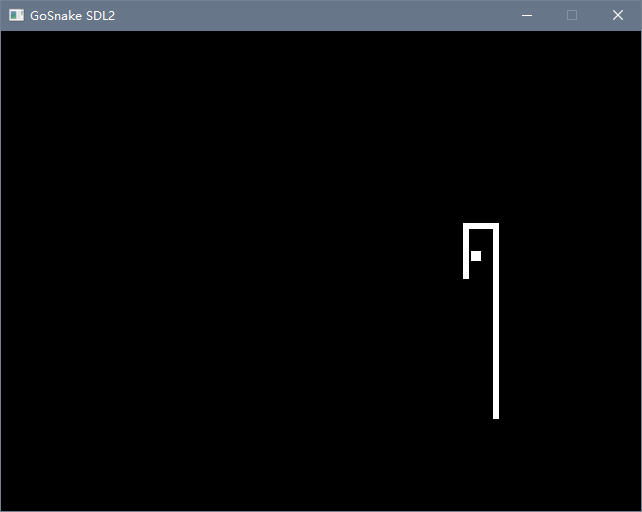

# GoSnake
Yet another snake game implemented in golang with [go-sdl2](https://github.com/veandco/go-sdl2).

---

## Control
↑↓←→: Move around

-=: Adjust Game Difficulty(-: Easier, +: Harder)

R: Restart Game

Esc: Exit Game

## Screenshots

## Build
To do here.

---

2022, net2cn, proudly coded in boring classes. (And finally get the game works after 2 years.)