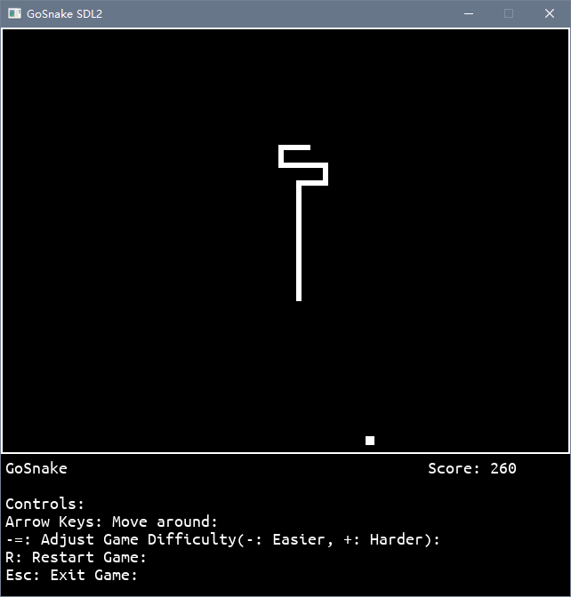

# GoSnake
Yet another snake game implemented in golang with [go-sdl2](https://github.com/veandco/go-sdl2).

---

## Screenshots


## Build
Install [go-sdl2](https://github.com/veandco/go-sdl2). After that simply type
```
go build main.go
```
and you'll get your game binary.

If you need the game to be built statically for redistribution, use the following line:
```
go build -tags static -ldflags "-s -w -H=windowsgui"
```
This will also get rid of the debug console. Remove "-H=windowsgui" if you need it.

---

2022, net2cn, proudly coded in boring classes. (And finally get the game works after 2 years.)